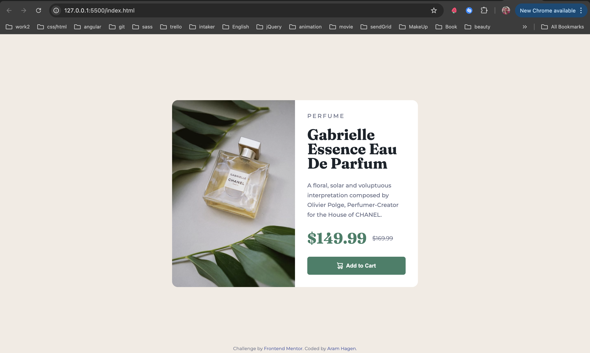
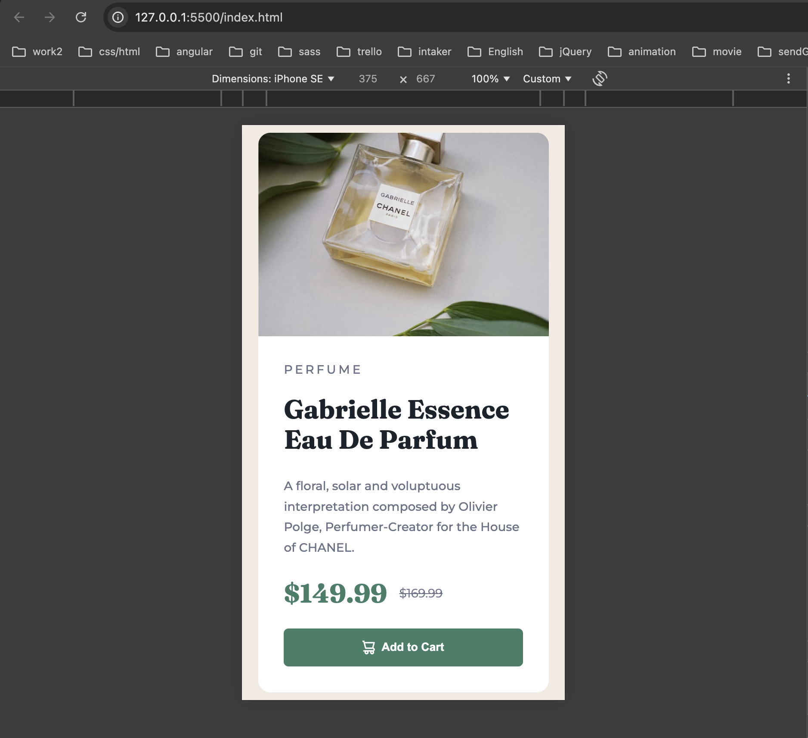

# Frontend Mentor - QR Code Component Solution

This is a solution to the [Product preview card component challenge on Frontend Mentor](https://www.frontendmentor.io/challenges/product-preview-card-component-GO7UmttRfa). Frontend Mentor challenges help you improve your coding skills by building realistic projects.

## Table of contents

- [Overview](#overview)
  - [Screenshot](#screenshot)
  - [Links](#links)
- [My process](#my-process)
  - [Built with](#built-with)
  - [What I learned](#what-i-learned)
  - [Useful resources](#useful-resources)

## Overview

### Screenshot

### Links

- Solution URL: [Add solution URL here](https://github.com/AramHagen/product-preview-card)
- Live Site URL: [Add live site URL here](https://aramhagen.github.io/product-preview-card/)

## My process

### Built with
- Semantic HTML5 markup
- CSS custom properties (CSS variables)
- CSS Grid layout
- Sass (SCSS)
- Mobile-first workflow

### What I learned

During this project, I learned how to use Picture tag and create responsive image. 

### Useful resources

- [w3schools](https://www.w3schools.com/tags/tag_picture.asp)

